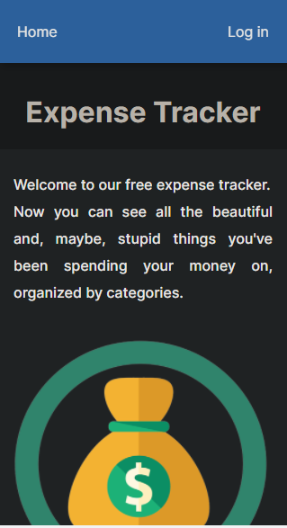
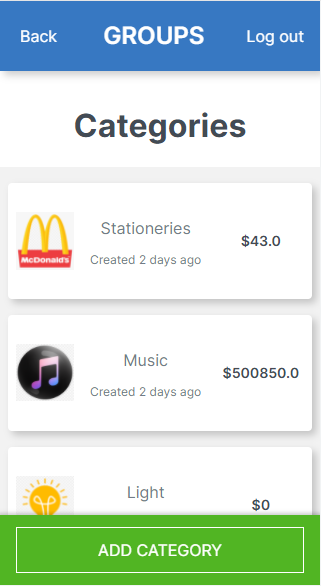
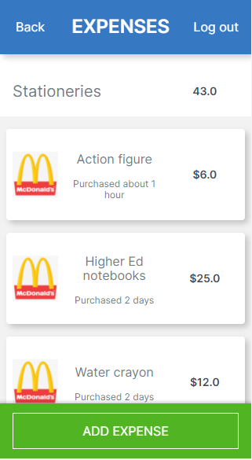

# ExpenseTrackrr

> ROR app to track your expenses.

ExpenseTrackrr is an app built with Ruby on Rails using the MVC architecture. The app allows users to track their expenses while grouping them into categories.

## Live demo
[See live demo here](https://expense-tracker-ue87.onrender.com)

## Built With

- Major languages: Ruby
- Frameworks: ROR
- Gems: devise, RSpec, Capybara

## Getting Started

To get a local copy up and running follow these simple example steps.

### Prerequisites

You need to have followings installed in your local machine:
- `Ruby`
- `Postgresql`
- `Rails`
- `RSpec`
- `node.js`

### Setup

To setup the Items Library project in your local, in the repo page: 
- click on code (dropdown list) > Download as ZIP. 
- or open terminal of path you want to install project and run this command:
`git clone git@github.com:codepantha/expense-tracker.git`
- `cd expense-tracker/`
- `bundle install`
- `bin/rails db:create`
- `bin/rails db:migrate`

## Instruction on the usage
- Run the following comands in your command line:
- `rails s`
- `open any chrome/firefox`
- `type "localhost:3000"`
- `enjoy the app`

## Tests
- To run tests for current app, please run below commands in your terminal:
- `cd expense-tracker/`
- `rspec spec spec/test_file_name`

## Author

👤 **Eze Promise**

- GitHub: [@codepantha](https://github.com/codepantha)
- LinkedIn: [LinkedIn](https://www.linkedin.com/in/promise-eze/)

## 🤝 Contributing

Contributions, issues, and feature requests are welcome!

Feel free to check the [issues page](https://github.com/codepantha/expense-tracker/issues).

## Show your support

Give a ⭐️ if you like this project!

## Acknowledgments

- This is app built withing the frames of CAPSTONE project of Rails Module at **[Microverse](https://www.microverse.org/)**, a remote school for developers, using their support and frameworks provided. 
Original design idea by [Gregoire Vella](https://www.behance.net/gregoirevella)

## 📝 License

This project is [MIT](./MIT.md) licensed.
